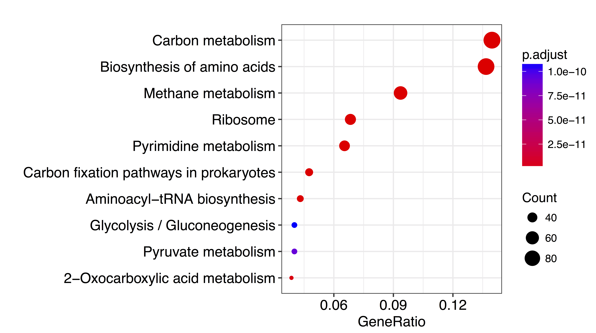
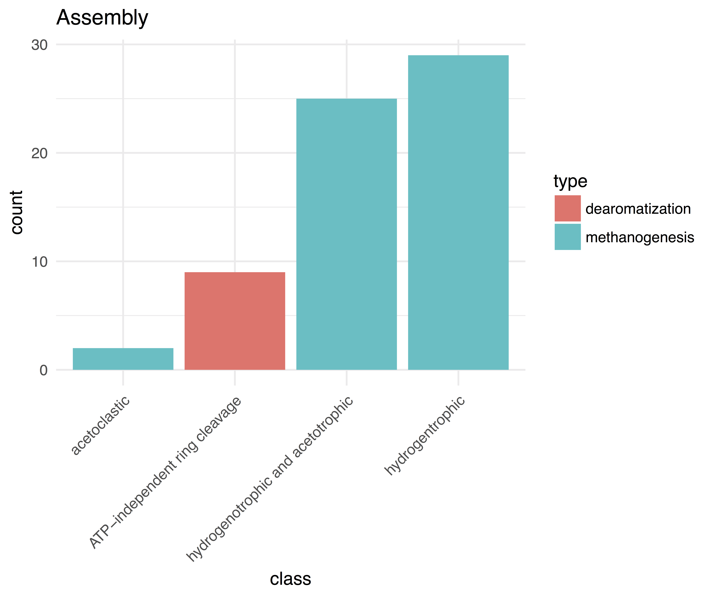

# Hu Bin Crumbs

By Taylor Reiter

## Background

Hu et al. 2016 undertook metagenomic analysis of microbial communities in oil reservoirs located in the Alaska North Slope. Methane production and carbon turnover (the return of carbon fixed by photosynthesis to atmospheric carbon dioxide) are two major biogeochemical transitions that occur in oil reservoirs. We focused our analysis on the Hu et al. SB1 sample, sampled from the Schrader Bluff Formation. Oil from this sample was the most degraded of all those sampled from the Alaska North Slope (Piceno et al. 2014), and the sample was not "soured" (via microbial hydrogen sulfide production).

## Methods overview

Of the 61 bins generated for sample SB1, we performed queries with 22 bins approximately 100% present in the SB1 metagenomic sample. We also performed queries from eight bins binned from SB2 which were also approximately 100% present in the SB1 metagenomic sample. After querying, we subtracted the bin used to perform the query (producing a *donut*), and then subtracted any sequence binned from any of the six Hu et al. metagenomic samples (producing *crumbs*). We refer to these sequences as unitig donuts and unitig crumbs, respectively. We next extracted any read that contained at least 10% of k-mers found in these unitigs and assembled these reads, producing donut assemblies and crumb assemblies. We analyzed \*unitigs and \*crumbs for functional and taxonomic content. We used prokka to find hypothetical protein coding domains in the unitigs and assemblies, and KEGG GhostKOALA for protein and taxonomic annotation. This write up focuses on the crumb assemblies.

## Results & Discussion

### General points

#### Neighborhood queries increase genome completeness

#### Something something, completeness correlates with something crumbly bumbly

### Taxonomic classification

#### Some neighborhood queries contain important marker genes

Nine crumb assemblies contained one of three marker genes used for taxonomic classification by Hu et al.: *gyrA* (12 observations), *gyrB* (eight observations), or *recA* (one observation) (**Table 1**). Because some queries were closely related, three marker gene sequences occurred in two crumb assemblies. To investigate the marker genes further, we BLASTed both the nucleotide and amino acid sequences against the NCBI nr/nt database (06/25/18), which includes the genome bins from Hu et al. We were curious whether the taxonomic assignment of the marker genes found in the crumb assemblies agreed with the assignment of the Hu bins, and whether the sequences identified in the crumb assemblies matched closely to other sequences in the Hu bins. 

##### Table 1: Taxonomic marker genes identified in crumb assemblies from the Hu SB1 sample. 
**bin**|**organism**|**name**|**score**|**In Hu bin?**
:-----:|:-----:|:-----:|:-----:|:-----:
hu-genome21|Candidate division WS6 bacterium 34\_10 |*gyrA*|80|No
hu-genome21|Candidate division WS6 bacterium 34\_10 |*gyrB*|66|No
hu-genome36|Desulfotomaculum sp. 46\_296 |*gyrA*|628|No
hu-genome36|Desulfotomaculum sp. 46\_296 |*gyrA*|95|No
hu-genome36|Desulfotomaculum sp. 46\_296 |*recA*|69|No
hu-genome10|Marinimicrobia bacterium 46\_43 |*gyrB*\*|425|No
hu-genome10|Marinimicrobia bacterium 46\_43 |*gyrA*\*|146|No
hu-genome35|Marinimicrobia bacterium 46\_47 |*gyrB*\*|425|No
hu-genome35|Marinimicrobia bacterium 46\_47 |*gyrA*\*|146|Yes
hu-genome24|Methanocalculus sp. 52\_23 |*gyrA*|238|No
hu-genome30|Methanoculleus marisnigri 62\_101|*gyrB*\*|214|No
hu-genome30|Methanoculleus marisnigri 62\_101|*gyrB*\*|210|No
hu-genome30|Methanoculleus marisnigri 62\_101|*gyrA*\*|127|Yes
hu-genome02|Methanoculleus marisnigri 63\_40|*gyrB*\*|214|No
hu-genome02|Methanoculleus marisnigri 63\_40 |*gyrB*\*|210|No
hu-genome02|Methanoculleus marisnigri 63\_40|*gyrA*\*|127|Yes
hu-genome38|Parcubacteria bacterium 33\_209 |*gyrB*|335|No
hu-genome38|Parcubacteria bacterium 33\_209 |*gyrA*|103|No
hu-genome38|Parcubacteria bacterium 33\_209 |*gyrA*|97|No
hu-genome33|Synergistales bacterium 53\_16 |*gyrA*\*|63|No
hu-genome03|Synergistales bacterium 54\_9 |*gyrA*\*|63|No
\* crumb assembly overlap

In general, we noted that taxonomic assignment using the crumb assembly marker gene sequences agreed with that of Hu et al.

In three instances, we identified additional marker gene sequences for genes that were present in the bin. We investigated two of these sequences further to determine if the crumbs contained redundant information (high nucleotide identity). First, the *gyrA* sequence identified in hu-genome35 crumbs had high amino acid identity to that identified in the hu-genome35 bin (134/138; 97%), however there was no match at the nucleotide level (see blast matches in the supplement). The closest match at the nucleotide level was to *Draconibacterium orientale* strain FH5T. Given the high degree of amino acid similarity between the binned sequence and the sequence in the crumb, this may reflect strain variation within the population. 

Second, the *gyrA* sequence in the crumb assemblies of hu-genome02 and hu-genome30 was identical, and a *gyrA* sequence was previously identified in the hu-genome02 bin. The closest amino acid match was to *Methanomicrobiales archaeon* (identities 102/111, 92%; e-value 4e-59), and there was no match to any Hu bins. The *M. archaeon* sequence was binned from a metagenome, and the organisms falls in an unclassified taxonomic class within order *Methanomicrobiales*, the order to which *Methanoculleus marisnigri* belongs. The closest nucleotide match was to *M. marisnigri* JR1 (identities 307/331, 93%, e-value 2e-134), and there was no match to any of the Hu bins. *M. marisnigri* JR1 was sequenced from an isolate. (BLAST alignments located in the supplement)

The crumb assembly from hu-genome36 had an especially strong match to *gyrA* (score 628), and so we investigated this sequence further. At the amino acid level, the closest match was to the hu-genome36 bin (identity 96%) (BLAST alignments located in supplement). However, the closest match to the nucleotide sequence was *Pelotomaculum thermopropionicum*, and the next best match was *Desulfotomaculum kuznetsovii*. *Pelotomaulum* and *Desulfotomaculum* are from the same family, *Peptococcaceae*. Again, this may indicate the presence of strain variation within the sample.

We also recovered marker genes from the crumb assembly of hu-genome38, a near-complete genome from a candidate phlya binned by Hu et al. The top amino acid hit was to the hu-genome38 bin *Parcubacteria bacterium* (identity 92%). Most other protein matches were to candidate phlya. The best nucleotide match was to *Sneathia amnii* strain SN35 with 70% identity, however *S. amnii* appears to be binned from a metagenome.

From the sequences we investigated, many had high amino acid identity to sequences in Hu et al. bins, however the nucleotide sequences were sufficiently different to return no match within the top 100 matches in a BLAST against the nt database. However, this was not always true, as in some cases there was no match at the amino acid level to the Hu bin.


#### Taxonomic signal from non-marker genes

We also investigated the taxonomic signal of non-marker genes in the crumb assemblies using GhostKOALA. We noted three trends. First, the taxonomic signal from archaeal crumb assemblies is accurate and consistent for predicted genes. The majority of genes were annotated at the correct genus level. There were a handful of genes in each crumb assembly that were annotated as a different genus of methanogenic archaea or as bacteria, however closer inspection of the bacterial annotations revealed that although there was no strong match in KEGG, archaeal sequence was a better match than bacterial sequence when BLASTed against RefSeq (**figure 1**). This may reflect horizontal gene transfer, however we did not investigate this hypothesis further (e.g. via site rate heterogeneity tests). 


Second, the taxonomic signal for predicted genes in bacterial crumb assemblies did not agree with bin assignments at the genus level. 

The second most abundant annotation for predicted genes in the crumb assemblies matched the genus assignment for hu-genome14, hu-genome29, and hu-genome36 (all *Desulfutomaculum*). *Pelotomaculum*, a genus in the same order as *Desulfotomaculum*, was the best match (**figure 2**). This trend, combined with the *gyrA* nucleotide match above, may indicate that the organism in these bins is more closely related to *Pelotomaculum* than to *Desulfutomaculum*, or that genus-level assignment is not possible given current taxonomic information. 


The same pattern was observed for the crumb assemblies of hu-genome25 and hu-genome40. These bins were annotated as class *Anaerolineae*, however a genus within this class was the second most abundant taxonomic annotation. The most abundant was *Brevibacterium*, which is in a different phylum than *Anaerolineae* (*Actinobacteria* vs. *Chloroflexi*). 

hu-genome03, hu-genome12, hu-genome31, and hu-genome33 were classified to the order *Synergistales*, however all four had strong matches to the genus *Thermovirga*, a genus within order *Synergistales*. 

Third, we observed that the taxonomic signal is clear at the kingdom level for predicted genes in crumb assemblies of candidate and unknown bins. This was true for hu-genome10, hu-genome13, hu-genome21, hu-genome27, hu-genome28, hu-genome34, hu-genome35, hu-genome37, and hu-genome38, all of which were candidate phyla (**figure 3**). No candidate phyla had a strong taxonomic signal, supporting their assignment into new taxonomic classifications. We observed a similar weak taxonomic signal for hu-genome23 and hu-genome39 which were not candidate phyla. 


	
### Functional characterization

#### Crumbs are enriched for metabolic genes

We performed a KEGG enrichment analysis on the genes found in the crumb assemblies. Only metabolic genes were significantly enriched for, with the exception of Ribosomal genes (**figure 4**). This contrasts to "informational" genes which are involved in replication, translation, and transcription of nucleotides. This may indicate that we recover more accessory genes, i.e. genes in the pangenome, instead of core genes in the crumb assemblies, but I'm not sure how to test this right now.



#### Crumbs contain predicted genes with biologically important roles

There's lots of stuff!Bacteria and archaea seem to contribute approximately equal amounts of functional content from crumb assemblies (**figure 5**). Carbon metabolism was the second most abundant BRITE hierarchy category, which likely reflects the degraded state of this reservoir, as reported by Piceno et al. 2014.   


There are also predicted genes that are important to the biology of the oil reservoir. Methane production and carbon degradation are important in oil reservoirs, and these are abundantly predicted in the crumb assemblies (**figure 6**).
 


#### Nitrogenase genes

Our approach also built upon observations of nitrogenase genes identified by Hu et al. We observed five additional nitrogenase gene sequences coding for portions of *nifH*, *glnB*, and *nifE*. All are located in crumbs of bins previously identified as containing nitrogen fixation genes. Both hu-genome24 and gu-genome02/30 contained a first observation of *glnB*, a nitrogen metabolism regulatory protein not previously observed in the SB1 sample but observed in a methanogenic archaea from the K3 sample. These observations support the Hu et al. conclusion that the majority of nitrogen fixation genes occur in methanogenic *Archaea* as opposed to *Bacteria*, in contrast to most other ecosystems. 

|query bin | organism | Crumb N. F.\* gene(s) | score | Bin id'd N. F. genes |
|----------|----------|-----------------------|-------|----------------------|
|hu-genome30 | Methanoculleus marisnigri 62_101 | *glnB*\** | 134 | *nifH*, *nifK*|
|hu-genome02 | Methanoculleus marisnigri 63_41 | *glnB*  | 134 | *nifH*, *nifK*|
|hu-genome02 | Methanoculleus marisnigri 63_41 | *nifH* | 340 | *nifH*, *nifK*|
|hu-genome24 | Methanocalculus sp. 52_23 | *glnB*  | 129 | *nifH*, *nifK*|
|hu-genome29 | Desulfotomaculum sp. 46_80 | *nifE* | 114 | *nifH*, *nifK*, *nifE*, *nifB*|
|hu-genome41 | Methanosaeta harundinacea 57_489 | *nifH* | 154 |  *nifH*, *nifE*|
*N. F. = Nitrogen Fixation
** overlap in crumbs, same observation as *glnB* in hu-genome02 crumbs.

#### Predicted crumb gene sequences have low homology to predicted bin gene sequences

As can be observed with the *gyrA* alignments, there is sometimes high amino acid identity with proteins that found in the bins, but there is not high nucleotide identity.


# Supplement

#### hu-genome35 blastp
```
DNA gyrase subunit A [Marinimicrobia bacterium 46_47]
Sequence ID: KUK54884.1
Length: 818
Number of Matches: 1

Alignment statistics for match #1 
Score	263 bits(672)  
Expect	8e-81 
Method	Compositional matrix adjust.
Identities	134/138(97%)
Positives	136/138(98%) 
Gaps		0/138(0%) 	 		

Query  1    MGRNASGVRGVTLANKEDRVVDMVVVKREGASVLAVSERGFGKRSEIVDYRVTNRGGKGV  60
            MGRNASGVRGVTLANK+DRVVDMVVVKREGASVLAVSERGFGKRSEIVDYRVTNRGGKGV
Sbjct  677  MGRNASGVRGVTLANKQDRVVDMVVVKREGASVLAVSERGFGKRSEIVDYRVTNRGGKGV  736

Query  61   ITLKTLPKIGKMVALKEVVDTDDLMLITVQGLLIRMHVRDISVYSRNTQGVRLIHLKPDD  120
            ITLKTLPKIGKMVALKEVVDTDDLMLITVQGLLIRMHVRDISVYSRNTQGVRLI+LKPDD
Sbjct  737  ITLKTLPKIGKMVALKEVVDTDDLMLITVQGLLIRMHVRDISVYSRNTQGVRLINLKPDD  796

Query  121  KISSVAYLKEDEETEEVE  138
            KISSVAYLKEDEE  EVE
Sbjct  797  KISSVAYLKEDEEAVEVE  814
```
#### hu-genome35 blastn
```
Draconibacterium orientale strain FH5T, complete genome
Sequence ID: CP007451.1Length: 5132075Number of Matches: 1
Related Information
Range 1: 4468272 to 4468437GenBankGraphics
Next Match
Previous Match
Alignment statistics for match #1 Score	Expect	Identities	Gaps	Strand
75.2 bits(82) 	2e-09 	116/166(70%) 	0/166(0%) 	Plus/Minus

Query  98       TTCTGGCTGTCAGCGAACGGGGCTTTGGAAAACGCTCTGAAATTGTCGATTATCGGGTGA  157
                |||||| |||   ||||   || | ||||||||| ||| ||||||  ||||| ||  | |
Sbjct  4468437  TTCTGGTTGTGGCCGAAAAAGGATATGGAAAACGTTCTAAAATTGATGATTACCGTATTA  4468378

Query  158      CCAACCGGGGAGGAAAAGGTGTAATCACCTTGAAAACGCTCCCCAAAATCGGGAAAATGG  217
                ||||||| || |||||||||||||  ||  |||| |    |   |||| |||  || |||
Sbjct  4468377  CCAACCGCGGTGGAAAAGGTGTAAAAACACTGAATATAACCGAAAAAACCGGCGAATTGG  4468318

Query  218      TTGCCCTGAAAGAAGTTGTGGATACAGATGATCTGATGTTGATTAC  263
                ||||| | |||   |||  |||     |||| |||||| | |||||
Sbjct  4468317  TTGCCATAAAAAGTGTTTCGGACGATAATGACCTGATGATTATTAC  4468272
```


```
DNA gyrase subunit A, partial [Methanomicrobiales archaeon HGW-Methanomicrobiales-6]
Sequence ID: PKL55814.1Length: 563Number of Matches: 1
Range 1: 453 to 563
Alignment statistics for match #1 
Score	 199 bits(507)
Expect	 4e-59
Method	 Compositional matrix adjust.
Identities	102/111(92%)
Positives	107/111(96%)
Gaps		0/111(0%)	 	 	 	 	

Query  1    MVEEDHLLTITERGFGKRTEFDEFRGHGRGTLGVRNIVVDARAGNVVGSMAVSNDDEIIV  60
            +VEE+HLLTITERG+GKRTEFDEFRGHGRGTLGVRNIVVDARAGNVVGSMAVS DDEIIV
Sbjct  453  VVEEEHLLTITERGYGKRTEFDEFRGHGRGTLGVRNIVVDARAGNVVGSMAVSGDDEIIV  512

Query  61   MSASGIVIRTKVSEISIQKRGTRGVRIMRLDDGDRVIGFTILDTEVNVEEA  111
            MSASGIVIRTKVSEISIQKRGTRGVR+MRLDDGDRVIGFTILD+E   EEA
Sbjct  513  MSASGIVIRTKVSEISIQKRGTRGVRVMRLDDGDRVIGFTILDSEEPGEEA  563
```
#### hu-genome02 *gyrA* blastn
```
 Methanoculleus marisnigri JR1, complete genome
Sequence ID: CP000562.1Length: 2478101Number of Matches: 1
Range 1: 1402294 to 1402624
Alignment statistics for match #1 
Score	489 bits(542) 
Expect	2e-134 
Identities	307/331(93%)
Gaps	0/331(0%)
Strand	Plus/Plus

Query  4        GTCGAGGAGGACCATCTCCTCACGATCACGGAGCGGGGTTTCGGGAAGCGGACGGAGTTC  63
                |||||||| |||||||||||||| |||||||||| ||| | |||||||||||||||||||
Sbjct  1402294  GTCGAGGACGACCATCTCCTCACCATCACGGAGCAGGGCTACGGGAAGCGGACGGAGTTC  1402353

Query  64       GACGAGTTCCGCGGCCACGGCAGGGGCACGCTCGGGGTGCGGAACATCGTCGTCGACGCC  123
                ||||||| ||||||||||||||||||||||||||||||||| ||||||||||||||||||
Sbjct  1402354  GACGAGTACCGCGGCCACGGCAGGGGCACGCTCGGGGTGCGAAACATCGTCGTCGACGCC  1402413

Query  124      CGGGCGGGCAACGTCGTCGGATCGATGGCGGTCTCCAACGATGACGAGATCATCGTGATG  183
                |||||||| ||||||||||| ||||||||||||||| |||| ||||||||||||||||||
Sbjct  1402414  CGGGCGGGTAACGTCGTCGGGTCGATGGCGGTCTCCGACGACGACGAGATCATCGTGATG  1402473

Query  184      AGCGCGTCCGGCATCGTGATCCGGACGAAGGTTTCCGAAATCTCGATCCAGAAGCGTGGC  243
                || ||||||||||||||||||||||||||||||||||| ||||||||||||||||| |||
Sbjct  1402474  AGTGCGTCCGGCATCGTGATCCGGACGAAGGTTTCCGAGATCTCGATCCAGAAGCGGGGC  1402533

Query  244      ACCCGCGGTGTCCGGATCATGAGGCTCGACGACGGCGACCGCGTCATCGGGTTTACGATC  303
                ||||||||||||||| ||||||  ||||||||||||||||| ||||||||||| ||||||
Sbjct  1402534  ACCCGCGGTGTCCGGGTCATGAAACTCGACGACGGCGACCGGGTCATCGGGTTCACGATC  1402593

Query  304      CTGGATACCGAGGTGAACGTGGAAGAGGCGT  334
                |||||| |||||| |  || |||||||||||
Sbjct  1402594  CTGGATTCCGAGGAGCCCGAGGAAGAGGCGT  1402624
```

#### hu-genome36 had one strong match to *gyrA* 

```
Pelotomaculum thermopropionicum SI DNA, complete genome
Sequence ID: AP009389.1Length: 3025375Number of Matches: 1
Range 1: 9125 to 10431
Alignment statistics for match #1 Score	Expect	Identities	Gaps	Strand
471 bits(522) 	2e-128 	904/1318(69%) 	22/1318(1%) 	Plus/Plus

Query  64     CATCCGCATGGCGATGTGGCTGTCTATGACGCCATGGTCCGTCTTGCTCAGAATTTTGCC  123
              || ||||| ||||||||||| || || |||||| |||||||||| || ||| ||||||||
Sbjct  9125   CACCCGCACGGCGATGTGGCCGTTTACGACGCCCTGGTCCGTCTGGCCCAGGATTTTGCC  9184

Query  124    TGTCGTTACCCTTTAATTGACGGGCATGGTAATTTTGGCTCACTGGACGGCGACGCACCT  183
              || || |||||  |  | |||||||| || ||||| || ||  ||||||||||| |  | 
Sbjct  9185   TGCCGCTACCCACTCGTGGACGGGCACGGCAATTTCGGTTCGGTGGACGGCGACTCGGCG  9244

Query  184    GCGGCGATGCGATATACAGAAGCCCGTATGGCGAAGATAGCTGTTACCATGCTTACGGAC  243
              ||||| ||||| || || |||||||| ||||| | |||| |  |    |||||| | || 
Sbjct  9245   GCGGCCATGCGCTACACCGAAGCCCGGATGGCCAGGATAACCCTGGAAATGCTTGCCGAT  9304

Query  244    ATTGACAAGGAAACGGTTGATTTTATACCTAACTATGATGG---AACTGTTGAGGAACCG  300
              || || || ||||||||| | ||||| ||||||||||| ||    || || |||   |||
Sbjct  9305   ATCGAAAAAGAAACGGTTAACTTTATTCCTAACTATGACGGCAAGACCGTAGAG---CCG  9361

Query  301    GTTGTACTGCCTTCCCGTATTCCAAACCTTCTGATCAACGGTTCGTCGGGAATTGCTGTC  360
                 || |||||  || | || || ||||| ||||| |||||||| || || |||||||| 
Sbjct  9362   ACCGTGCTGCCGGCCAGGATACCGAACCTGCTGATAAACGGTTCTTCAGGCATTGCTGTG  9421

Query  361    GGTATGGCGACAAACATACCTCCTCATAATTTAGGTGAAGTTATTGACGGTATCATTATG  420
              || ||||| || ||||| || || |||||  | || || |||||||||||  | || |||
Sbjct  9422   GGCATGGCCACCAACATTCCCCCCCATAACCTCGGCGAGGTTATTGACGGCGTGATCATG  9481

Query  421    CTGATTGATGATCCTCAGACGACCGTAGAAC----AAATTATGGATAAAATAAAAGGGCC  476
              || || ||  | |||  ||||  || | | |    |  |||||      || || |||||
Sbjct  9482   CTTATAGACAACCCT--GACG--CGAATATCAGGGATCTTATGAGCGTCATTAAGGGGCC  9537

Query  477    AGATTTTCCCACCGGCGGATATATTATGGGCCATCGGGGAATAAGGGAAGCATACAGCAG  536
               |||||||| ||||||||  | || |||||||    ||| ||  |||| || ||| ||| 
Sbjct  9538   GGATTTTCCAACCGGCGGTAAAATCATGGGCCGGGAGGGTATCTGGGACGCCTACCGCAC  9597

Query  537    AGGCCGGGGTTCTATTAAAATGAGGGCAAAAACGGAGATCGAAAAAATCGGCAGCGGAAA  596
               ||||||||    || ||  || ||||  |  |    || ||||| |||||| |||| | 
Sbjct  9598   CGGCCGGGGCAGCATCAAGGTGCGGGCCCAGGCTTCTATTGAAAAGATCGGCGGCGGCAG  9657

Query  597    G-ACGGCTATTATCGTCAATGAAATACCTTTTTTGGTTAATAAAGCAAGACTTGTTGAAA  655
              | || || ||| | ||||  |||||||||| |  ||| || || || || ||  ||||||
Sbjct  9658   GCACAGC-ATTGTGGTCAGCGAAATACCTTATCAGGTAAACAAGGCCAGGCTGATTGAAA  9716

Query  656    AAATTGCCGAGCTGGTCAAAGaaaaaaaGATTGACGGAATAACGGATTTAAGGGACGAAT  715
              |||||||||| ||||| || || ||||| || ||||| || |  ||  |  | || || |
Sbjct  9717   AAATTGCCGAACTGGTTAAGGATAAAAAAATAGACGGCATCAGCGACCTGCGCGATGAGT  9776

Query  716    CGGACCGCAAGGGGCTCCGTGTAGTCATTGAGCTAAGACGCGGCGTCGATCCCCAGGTAA  775
              ||||||||   ||  | ||  |||| || || || || ||||  | | | || |||||| 
Sbjct  9777   CGGACCGCCGCGGCATGCGAATAGTGATAGAACTCAGGCGCGATGCCAACCCGCAGGTAG  9836

Query  776    TCCTGAATTATCTTTATAAGCATACACAGCTTCAGGAAAGTTTCGGTGTAATTATGCTTG  835
              |  | ||  | ||||| |||||||| ||  | ||||| || ||||| ||||| ||||| |
Sbjct  9837   TTTTAAACCAGCTTTACAAGCATACCCAAATGCAGGACAGCTTCGGGGTAATCATGCTGG  9896

Query  836    CGCTTGTTGAAGGAAGACCGCAGGTTCTT-AATTTGCGCGAGATCCTTTCCCACTACCTG  894
              | | || || |||  || | |||| |||| |||||    ||| |||| |   ||||||| 
Sbjct  9897   C-CCTGGTGGAGGGGGAACCCAGGGTCTTAAATTTAAAAGAGGTCCTCTTTTACTACCTT  9955

Query  895    AAGCATCAAAAAGAAGTTATTACAAGAAGAACCAAGTTTGACCTGAGAAAGGCGGAAGAG  954
               |||| || || || ||| |     |  | ||    || || ||||    ||| || | |
Sbjct  9956   CAGCACCAGAAGGACGTTGTGGTCCGCCGCACGCGCTTCGAACTGAACCGGGCAGAGGCG  10015

Query  955    AGAATTCATATTGTCGAGGGTTTAATAATTGCCCTTGACCACATCGATGAAGTAATTGAA  1014
               |    ||||| || || ||  |    |||||| ||| |||| | || || |||||| ||
Sbjct  10016  CGGGCGCATATAGTGGAAGGGCTGCGCATTGCCATTGCCCACCTGGACGAGGTAATTAAA  10075

Query  1015   ACAATTCGTTCTTCAAGGACTGTCGAAATTGCCAGAAGGGCTCTTTGTGAGCGCTTTGAT  1074
              || || || || ||  ||||    ||| | ||||| | ||| ||    |||   || |  
Sbjct  10076  ACCATCCGCTCATCGCGGACCCCGGAAGTAGCCAGGAAGGCCCTGATGGAGAAGTTCGGC  10135

Query  1075   CTTACACAGAAGCAGGCTGACGCTATTTTGGACATGCGCCTGCAGCGCCTGACAGGATTG  1134
              || ||  | |||||||| || || ||| |||| |||||| ||  ||  ||||| ||  ||
Sbjct  10136  CTGACCGAAAAGCAGGCCGAGGCCATTGTGGAAATGCGCTTGAGGCAACTGACCGGCCTG  10195

Query  1135   GAAAGGGAAAAACTTGACCGTGAGTATGAAGATCTGAGGGAAAAAATTTCAACCCTGCGC  1194
              ||  |||||||||| || |  |||||    || |||  |||||||||| |   |||||||
Sbjct  10196  GAGCGGGAAAAACTGGAACAGGAGTACAGGGAACTGGTGGAAAAAATTGCTTACCTGCGC  10255

Query  1195   GGTATTCTTGCTGATGAGGCGAAAGTATATCGAATTATCAAAGAAGAACTAACCGGTATC  1254
                | | || | ||| |||  ||||||     | ||||| ||||| || ||    ||    
Sbjct  10256  TCTGTGCTGGATGACGAGCGGAAAGTCCTCGGCATTATTAAAGACGAGCT-TTTGGCCGT  10314

Query  1255   AAAGAAAAA-TTTAACGACTTAAGAAGGACGG-AGATATTAGCAGAAGAGGTAACACTGG  1312
              ||||||||| |||  ||||    |  |||||| |  ||  ||| |||||||   |  | |
Sbjct  10315  AAAGAAAAAGTTTGCCGACCCGCGGCGGACGGCAATTACGAGC-GAAGAGGCGGCCTTCG  10373

Query  1313   ATGAGGAAGATTTGATTGCCGAAGAAGAAGTTGTGATTACGGTAAGCAATCAGGGGTA  1370
              | || || ||  ||||| | |||||||| || ||||||||  | | ||  ||||||||
Sbjct  10374  AGGAAGAGGACCTGATTCCGGAAGAAGACGTGGTGATTACCATCACCAGCCAGGGGTA  10431
```
```
Desulfotomaculum kuznetsovii DSM 6115, complete genome
Sequence ID: CP002770.1Length: 3601386Number of Matches: 1
Range 1: 6246 to 7597
Alignment statistics for match #1 Score	Expect	Identities	Gaps	Strand
437 bits(484) 	4e-118 	914/1357(67%) 	10/1357(0%) 	Plus/Plus

Query  19    CACCGCAAAAGCGCAAACGTCGTTGGTTTTGTCCTTCAGAAATTTCATCCGCATGGCGAT  78
             |||||||| |||||  || | || |||   ||  |    ||||| || || || || |||
Sbjct  6246  CACCGCAAGAGCGCCCACATTGTGGGTGAGGTAATGTCCAAATTCCACCCCCACGGGGAT  6305

Query  79    GTGGCTGTCTATGACGCCATGGTCCGTCTTGCTCAGAATTTTGCCTGTCGTTACCCTTTA  138
              ||||  | || |||||| |||| ||  | || ||| | |||||| | || || ||  | 
Sbjct  6306  ATGGCCATTTACGACGCCCTGGTGCGCATGGCCCAGGACTTTGCCAGCCGCTATCCCCTG  6365

Query  139   ATTGACGGGCATGGTAATTTTGGCTCACTGGACGGCGACGCACCTGCGGCGATGCGATAT  198
              | ||||| || || |||||||| ||  | || |||||||| || ||||| ||||| || 
Sbjct  6366  GTGGACGGCCACGGCAATTTTGGTTCCGTTGATGGCGACGCTCCGGCGGCTATGCGCTAC  6425

Query  199   ACAGAAGCCCGTATGGCGAAGATAGCTGTTACCATGCTTACGGACATTGACAAGGAAACG  258
             || |||||||| |||||    ||  |  |  |||||||  |||| ||||| ||| | |||
Sbjct  6426  ACGGAAGCCCGCATGGCCCGCATTACCATGGCCATGCTGGCGGATATTGAAAAGAATACG  6485

Query  259   GTTGATTTTATACCTAACTATGATGGAACTGTTGAGGAACCGGTTGTACTGCCTTCCCGT  318
             || || ||  | || ||||| || || |     ||||||||    ||| ||||  | || 
Sbjct  6486  GTCGACTTCCTCCCCAACTACGACGGCAGCAACGAGGAACCAAAAGTATTGCCCGCTCGC  6545

Query  319   ATTCCAAACCTTCTGATCAACGGTTCGTCGGGAATTGCTGTCGGTATGGCGACAAACATA  378
             || || ||| | ||  | ||||| || ||||| ||||| || || ||||| || || || 
Sbjct  6546  ATCCCCAACTTGCTCGTGAACGGCTCTTCGGGCATTGCCGTGGGCATGGCCACCAATATT  6605

Query  379   CCTCCTCATAATTTAGGTGAAGTTATTGACGGTATCATTATGCTGATTGATGATCCTCAG  438
             || || || ||  | || ||||| ||||||||  | || | ||| || ||  | ||  | 
Sbjct  6606  CCGCCCCACAACCTGGGGGAAGTAATTGACGGCGTGATCAGGCTAATCGACAACCCGGAC  6665

Query  439   ACGACCGTAGAACAAATTATGGATAAAATAAAAGGGCCAGATTTTCCCACCGGCGGATAT  498
             |  ||| |     |  | ||| |   ||| || ||||| || || |||||||||||  | 
Sbjct  6666  ATCACCATCCCGGAGTTGATGCAGGTAATCAAGGGGCCCGACTTCCCCACCGGCGGGAAG  6725

Query  499   ATTATGGGCCATCGGGGAATAAGGGAAGCATACAGCAGA--GGCCGGGGTTCTATTAAAA  556
             ||||||||||  | ||| ||  |||| || |||  ||||  ||||||||  | || ||  
Sbjct  6726  ATTATGGGCCGCCAGGGCATCCGGGAGGCCTAC--CAGACGGGCCGGGGGGCCATAAAGG  6783

Query  557   TGAGGGCAAAAACGGAGATCGAAAAAATCGGCAGCGGAAAGACGGCTATTATCGTCAATG  616
             || | ||  |  |   | | |||||||| ||| | || ||||  || ||||||||| | |
Sbjct  6784  TGCGCGCCCAGGCCACGGTGGAAAAAATTGGCGGAGGTAAGAGCGCCATTATCGTCCACG  6843

Query  617   AAATACCTTTTTTGGTTAATAAAGCAAGACTTGTTGAAAAAATTGCCGAGCTGGTCAAAG  676
             | ||||||||| |||| || || ||  | ||  |||||||||| ||||| ||||||   |
Sbjct  6844  AGATACCTTTTATGGTGAACAAGGCCCGGCTGATTGAAAAAATCGCCGAACTGGTCCGGG  6903

Query  677   aaaaaaaGATTGACGGAATAACGGATTTAAGGGACGAATCGGACCGCAAGGGGCTCCGTG  736
             |||| || || ||||| || || ||| |  ||||||||||||||||   |||  | ||  
Sbjct  6904  AAAAGAAAATCGACGGCATTACCGATCTGCGGGACGAATCGGACCGGCGGGGAATGCGCA  6963

Query  737   TAGTCATTGAGCTAAGACGCGGCGTCGATCCCCAGGTAATCCTGAATTATCTTTATAAGC  796
             | |||||||||||  | || |  | | | |||| ||| ||||||||  | || || ||||
Sbjct  6964  TTGTCATTGAGCTGCGGCGGGATGCCAAGCCCCGGGTGATCCTGAACCAGCTCTACAAGC  7023

Query  797   ATACACAGCTTCAGGAAAGTTTCGGTGTAATTATGCTTGCGCTTGTTGAAGGAAGACCGC  856
             |||| ||| | |||||||  ||||| ||||| ||||| || || || || ||    || |
Sbjct  7024  ATACCCAGATGCAGGAAACCTTCGGGGTAATCATGCTGGCCCTGGTGGACGGCCAGCCCC  7083

Query  857   AGGTTCTTAATTTGCGCGAGATCCTTTCCCACTACCTGAAGCATCAAAAAGAAGTTATTA  916
             ||||  | ||  ||||  |||| ||   ||| |||||| |||| || || |||||  |  
Sbjct  7084  AGGTATTGAACCTGCGGCAGATGCTGGGCCATTACCTGGAGCACCAGAAGGAAGTGGTCG  7143

Query  917   CAAGAAGAACCAAGTTTGACCTGAGAAAGGCGGAAGAGAGAATTCATATTGTCGAGGGTT  976
                |  | |||   |||||||||  |||||| || |   |    || ||||| || ||| 
Sbjct  7144  TCCGGCGCACCCGCTTTGACCTGGAAAAGGCCGAGGCCCGGGCGCACATTGTGGAAGGTC  7203

Query  977   TAATAATTGCCCTTGACCACATCGATGAAGTAATTGAAACAATTCGTTCTTCAAGGACTG  1036
             |    |||||||| || ||||| || || || ||  | || || ||  | ||  |||| |
Sbjct  7204  TGCGCATTGCCCTGGATCACATTGACGAGGTCATCAACACTATCCGGGCCTCCCGGACGG  7263

Query  1037  TCGAAATTGCCAGAAGGGCTCTTTGTGAGCGCTTTGATCTTACACAGAAGCAGGCTGACG  1096
             | ||||| || | ||  || |||   ||    || |  ||| |  | || |||||  | |
Sbjct  7264  TGGAAATAGCGAAAAATGCCCTTATGGAAAAATTCGGCCTTTCCGAAAAACAGGCCCAGG  7323

Query  1097  CTATTTTGGACATGCGCCTGCAGCGCCTGACAGGATTGGAAAGGGAAAAACTTGACCGTG  1156
             | ||| |||||||||| |||||||||||||| ||  ||||  |||| || || ||    |
Sbjct  7324  CCATTCTGGACATGCGTCTGCAGCGCCTGACCGGTCTGGAGCGGGATAAGCTGGAAGAGG  7383

Query  1157  AGTATGAAGATCTGAGGGAAAAAATTTCAACCCTGCGCGGTATTCTTGCTGATGAGGCGA  1216
             | ||  |||| ||   ||| | |||| |   |||||| ||| | || || || |||   |
Sbjct  7384  AATACAAAGAACTCCTGGACAGAATTGCCTACCTGCGGGGTGTGCTGGCCGACGAGCGAA  7443

Query  1217  AAGTATATCGAATTATCAAAGAAGAACTAACCGGTATCAAAGAAAAATTTAACGACTTAA  1276
             |||| |  |  ||||| | ||| || || ||||  ||     | ||||||  |||     
Sbjct  7444  AAGTTTTGCAGATTATTAGAGATGAGCTCACCGAAATGCGGCAGAAATTTGCCGATCCCC  7503

Query  1277  GAAGGACGGAGATATTAGCAGAAGAGG---TAACACTGGATGAGGAAGATTTGATTGCCG  1333
             |  | |||| |  || ||| || ||||     || ||||| |  || ||  ||||| | |
Sbjct  7504  GCCGCACGGTG--ATCAGC-GACGAGGACACCACCCTGGAAGCCGAGGACCTGATTCCGG  7560

Query  1334  AAGAAGAAGTTGTGATTACGGTAAGCAATCAGGGGTA  1370
             |||||||||| ||||| ||  | | ||| ||||||||
Sbjct  7561  AAGAAGAAGTGGTGATCACCATCACCAACCAGGGGTA  7597

```